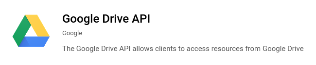

# A simple Node.js application with the Google Drive API

This guide will explain how to integrate with the Google API for Google Drive using the `googleapi` npm package.
I try to make as few assumptions as possible and will be starting from scratch. If you've already done
some setup yourself, feel free to skip to the relevant section.
The app is a bare-bones command line implementation meant to get you started.
You'll then be ready to explore and play around with the API yourself.

##### If you're just looking for the code it can be found [as a GitHub gist](https://gist.github.com/ScottG489/b6d134d37dcbb4e8f9e07aca48a9cde1)
Or run the following:
```shell script
git clone git@github.com:b6d134d37dcbb4e8f9e07aca48a9cde1.git google-drive-api-project
cd google-drive-api-project
npm install
```

Then copy in your service account's `credentials.json` key file and run:
<br/>
```shell script
ts-node index.ts
```
<br/>

## Table of contents
1. [Google Cloud API setup](#google-cloud-api-setup)
    1. [Setting up Google Cloud](#setting-up-a-google-cloud-account)
    2. [Creating a project](#creating-a-project)
    3. [Configuring your project to use Google Drive](#configuring-your-project-to-use-the-google-drive-api)
    4. [Setting up credentials](#setting-up-credentials)
        1. [Create a service account](#create-a-service-account)
        2. [Add a key to your service account](#add-a-key-to-your-service-account)
2. [Google Drive configuration](#google-drive-configuration)
    1. [Find your service account's `client_email`](#find-your-service-accounts-client_email)
    2. [Share your files with the service account](#share-your-files-with-the-service-account)
3. [Application code and configuration](#application-code-and-configuration)
    1. [Install prerequisites](#install-prerequisites)
    2. [Project configuration](#project-configuration)
    3. [Application code](#application-code)
    4. [Running the application](#running-the-application)
4. [Conclusion](#conclusion)
<br/>
<br/>

## Google Cloud API setup
### Setting up a Google Cloud account
In order to access Google APIs you need to set up [Google Cloud](https://console.cloud.google.com).
Navigate to their [getting-started](https://cloud.google.com/getting-started) page and click on **[Get started for free](https://console.cloud.google.com/freetrial)**
in the top right corner.
If you already have a Google account (who doesn't?), follow the guide to sign up and then you should be brought to the [Google Cloud Dashboard](https://console.cloud.google.com/).

Note that I set up my Google Cloud account years ago, so I apologize if this sign up procedure is a little off.

### Creating a project
Google should create your first project for you but if you want to create a new one for yourself, or manage all of your 
projects in the future, you can go to the [Cloud Resource Manager](https://console.cloud.google.com/cloud-resource-manager)
to do so.

### Configuring your project to use the Google Drive API

Once you're in your project navigate to your project's [dashboard](https://console.cloud.google.com/apis/dashboard).
Here you can click on **[ENABLE APIS AND SERVICES](https://console.cloud.google.com/apis/library?project=api-access-832bc17f4878)**.
Search for "drive" and click on [Google Drive API](https://console.cloud.google.com/apis/library/drive.googleapis.com)
once it pops up. You can also navigate to it directly by clicking the previous link and enabling it for your project.

### Setting up credentials
After you've enabled Google Drive for your project, click **[Manage](https://console.cloud.google.com/apis/api/drive.googleapis.com/overview)**
and then on the left nav bar click **[Credentials](https://console.cloud.google.com/apis/api/drive.googleapis.com/credentials)**.

#### Create a service account
In the nav bar near the top click **CREATE CREDENTIALS** and then in the dropdown, **[Service account](https://console.cloud.google.com/iam-admin/serviceaccounts/create)**.
Give the service account a name and description then click **CREATE**. In the next step you'll also need to grant
the service account access to your project. I opted for the "Owner" role which gives "Full access to all resources".
However, depending on your use case, there may be a more targeted role you could choose.

#### Add a key to your service account
Once you're back on the **[Credentials](https://console.cloud.google.com/apis/api/drive.googleapis.com/credentials)**
page, under the **Service Accounts** section, click on the service account you just created to edit it. At the bottom of
the **Service account details** page, under the **Keys** section, click on **ADD KEY**. In the dialog window that
pops up choose "JSON" then click **CREATE**. For the purposes of this guide this is the format we'll be using
and is important for later steps. The download dialog window should then pop up, and you should save the file
into your project's directory. Later on in the guide I'll refer to this file as `credentials.json`.
___
I should note that this was the first project I've set up in Google Cloud. So keep that in mind in case you run
into something that conflicts with this guide. However, I've made every effort to make sure the steps are
accurate to my experience.

Otherwise, this should be all the setup you need to do in Google Cloud. Next we'll start creating our application!

## Google Drive configuration
In order for the service account you've created to have access to your personal Google account's Drive you need
to share the file(s) or directory(s) with it. Personally I found this a bit awkward, and it would be nice for
there to be a way to give my application access to everything my personal account has access to in Drive. If
anyone knows how to do this (without an **OAuth** popup) I'd be interested to know.

## Find your service account's `client_email`
In the `credentials.json` file you downloaded earlier there should be a field called `client_email`. Note this
down as you'll need it for the next step.
If you happen to have `jq` installed you can run `jq -r .client_email credentials.json`.

## Share your files with the service account
Navigate to [Google Drive](https://drive.google.com/) and find the file(s) or directory(s) you wish to share with
the service account. Right click on them and in the menu select **Share**. In he *Add people and groups** text
box enter the `client_email` value from the last step. To the right of this text box there's a dropdown that will
let you select what permissions the service account will have. Choose whatever is appropriate for your use case.
For the purpose of this guide, we only need read access so I selected "Viewer". Then click the **Share** button
in the bottom right of the dialog box.

## Application code and configuration


### Install prerequisites

For this project we'll be using:
- `node` **v10.19.0**
- `npm` **v6.14.4**
- `ts-node` **v9.0.0** 


[Node.js](https://nodejs.org/) is very popular and can probably be installed with any package manager. You can
also download it from the [Node.js downloads](https://nodejs.org/en/download/) page. Once you've installed
`node` you'll also have `npm` installed.
To install `ts-node` run `npm install -g ts-node` or follow the [ts-node installation](https://www.npmjs.com/package/ts-node#installation)
instructions.

### Project configuration
To configure our `npm` project we'll need a `package.json` and a `tsconfig.json`.
Below you'll find minimal versions of these files.
<br/>
<br/>

`package.json`
```json
{
  "name": "google-drive-api-project",
  "version": "1.0.0",
  "description": "Google Drive API with Node.js",
  "main": "index.js",
  "scripts": {
    "test": "echo \"Error: no test specified\" && exit 1"
  },
  "repository": {
    "type": "git",
    "url": "https://gist.github.com/ScottG489/b6d134d37dcbb4e8f9e07aca48a9cde1"
  },
  "author": "",
  "license": "ISC",
  "dependencies": {
    "typescript": "^4.0.3",
    "googleapis": "^61.0.0"
  }
}
```
The `package.json` has been generated from `npm init` and I've added the latest version (at the time of writing)
of the package's we'll need. You may want to install the latest versions yourself. You can do so by
running `npm install typescript googleapis`.

<br/>

`tsconfig.json`
```json
{
  "compilerOptions": {
    "target": "ES2015",
    "module": "commonjs",
    "strict": true,
    "esModuleInterop": true,
    "skipLibCheck": true,
    "forceConsistentCasingInFileNames": true
  },
  "$schema": "https://json.schemastore.org/tsconfig",
  "display": "Recommended"
}
```
The `tsconfig.json` was taken from the [recommended](https://github.com/tsconfig/bases/blob/master/bases/recommended.json)
`tsconfig.json` from the [Centralized Recommendations for TSConfig bases](https://github.com/tsconfig/bases)
GitHub project.

After you have these two files in place run `npm install`.

### Application code

The example code is a simple demonstration that lists all the files that have been shared with the
service account.

`index.ts`
```typescript
import {google} from 'googleapis';

const auth = new google.auth.GoogleAuth({
    keyFile: './credentials.json',
    scopes: ['https://www.googleapis.com/auth/drive'],
});
const drive = google.drive({version: 'v3', auth});

(async () => {
    const driveResponse = await drive.files.list({
        fields: '*',
    });
    console.log(driveResponse.data.files);
})().catch(e => {
    console.log(e);
});
```

Note the reference to your `credentials.json` file. This needs to be in the same directory before `index.ts` can
be run.

### Running the application
```shell script
ts-node index.ts
```

The application will print out the JSON object representation of the file(s) you
[previously](#share-your-files-with-the-service-account) shared with the service account.

## Conclusion
You now have a working example integrated with the [Google Drive API](https://developers.google.com/drive). However, you likely want to do more than just
print out the JSON objects of your Google Drive files.

The best starting point is to check out the documentation on the npm [googleapis](https://www.npmjs.com/package/googleapis)
package page. You can also find some nice samples in the GitHub [google-api-nodejs-client](https://www.npmjs.com/package/googleapis)
repository.
